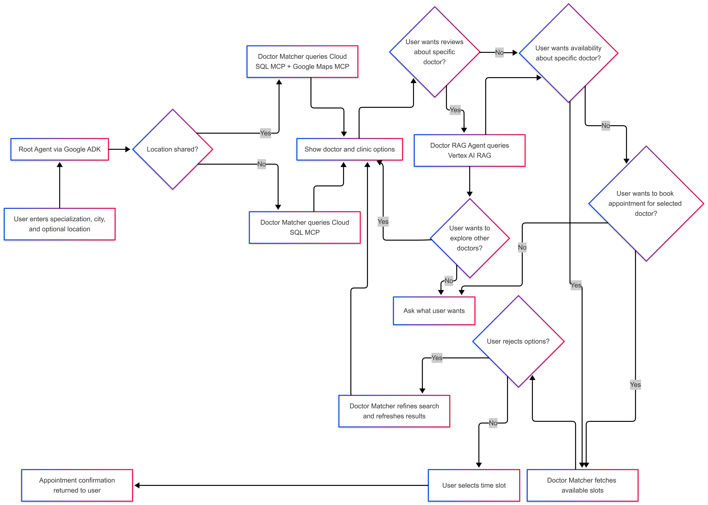
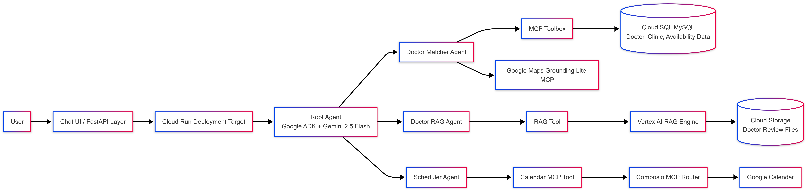

# Doctor Appointment Scheduler

## Project Overview

Doctor Appointment Scheduler is an AI-powered, multi-agent doctor appointment booking solution built to simplify the complete patient journey in a single conversational experience. Instead of forcing users to search across clinic portals, compare doctors manually, read reviews from separate sources, calculate travel time, check availability, and then book on another platform, this system brings all of those steps together through coordinated AI agents and MCP-based tool integrations. It helps users discover suitable doctors by specialization and city, evaluate options using clinic location and patient feedback, choose convenient time slots, and finally schedule the appointment directly on Google Calendar, making the overall process faster, smarter, and more user-friendly.

## Why This Project Matters

Most doctor discovery and appointment booking experiences are fragmented. Users often need to switch between multiple apps and websites just to answer a few basic questions:

- Which doctor matches my medical need?
- Which clinic is closest to me?
- How long will it take to reach there?
- What do other patients say about the doctor?
- Is the doctor available at my preferred time?
- How do I confirm the appointment quickly?

This project addresses that fragmentation by combining search, reasoning, review retrieval, route estimation, and scheduling into one unified AI-assisted workflow.

### Main Advantages

- End-to-end conversational booking experience instead of isolated search or booking steps
- Multi-agent architecture that separates coordination, doctor matching, review intelligence, and scheduling
- Grounded responses using structured data and retrieval instead of generic chatbot answers
- Better decision-making through doctor reviews, clinic details, and travel-time awareness
- Reduced user effort by directly creating the appointment in Google Calendar

### What Makes It Different

Unlike a typical healthcare chatbot or doctor directory, this solution is action-oriented. It does not stop at recommending doctors. It can pull doctor and clinic data, estimate distance and travel duration, retrieve grounded patient review insights, check available slots, and complete the booking workflow. Its biggest USP is that discovery, decision-making, and appointment scheduling happen in one intelligent flow without forcing the user to switch tools repeatedly.

## Features

- Doctor, clinic, and doctor availability search via Cloud SQL MCP
- Distance and travel time calculation from the user's location to the clinic via Google Maps MCP
- Doctor review discovery through a Vertex AI RAG pipeline
- Appointment scheduling through Google Calendar MCP
- Multi-agent orchestration using a root coordinator, doctor matcher, review agent, and scheduler agent
- Human-in-the-loop conversational refinement for comparing doctors, checking reviews, verifying slots, and confirming bookings

## Technologies Used

This project uses a modular Google Cloud and MCP-first architecture so each part of the workflow is handled by the most appropriate managed service or tool integration.

- Google ADK for multi-agent orchestration and delegation
- Gemini 2.5 Flash for conversational reasoning and task coordination
- Vertex AI for model access and agentic AI integration
- Vertex AI RAG Engine for grounded retrieval over doctor review data
- `text-embedding-005` for review document embeddings
- Google Cloud SQL for structured doctor, clinic, and availability data
- MCP Toolbox for exposing Cloud SQL queries as MCP tools
- Google Maps Grounding Lite MCP for route, distance, and travel-time estimation
- Google Cloud Storage for storing doctor review documents used by the RAG pipeline
- Composio for Google Calendar MCP connectivity and OAuth-backed action execution
- FastAPI for the application entrypoint/API layer
- Cloud Run as the intended deployment target for scalable, container-based hosting on Google Cloud

### Why This Stack

- It cleanly separates reasoning, retrieval, search, and action execution
- It supports modular growth as new agents or tools are added
- It is suitable for real-world deployment because the app logic remains lightweight while managed cloud services handle scale, storage, and integrations
- It supports production-style extensibility for new cities, specialties, data sources, and scheduling integrations

## Process Flow Diagram

## Architecture Diagram

## Installation and Setup

The complete environment setup, Google Cloud configuration, database creation, MCP setup, RAG pipeline preparation, Maps integration, and Google Calendar integration steps are documented in [Project_Steps.md](Project_Steps.md).

### Setup Summary

1. Create and configure a Google Cloud project.
2. Enable the required Google Cloud APIs such as Vertex AI, Cloud SQL, Cloud Run, Cloud Storage, IAM, and Maps services.
3. Create the required service account and assign the necessary IAM roles.
4. Create the Cloud SQL instance and database.
5. Generate and import the synthetic seed SQL data from the `data/seed_sql` flow.
6. Configure the Cloud SQL MCP Toolbox using [`tools/cloudsql_mcp/tools.yaml`](tools/cloudsql_mcp/tools.yaml).
7. Upload doctor review files to Google Cloud Storage and configure the Vertex AI RAG pipeline.
8. Configure Google Maps MCP for route and travel-time support.
9. Configure Composio and connect Google Calendar for appointment scheduling.
10. Install Python dependencies and run the agents/application locally.

### Core Project References

- Setup guide: [Project_Steps.md](Project_Steps.md)
- Review upload guide: [gcs_upload_guide.md](gcs_upload_guide.md)
- API entrypoint: [api/main.py](api/main.py)
- Root agent: [agents/root_agent/agent.py](agents/root_agent/agent.py)
- Doctor matcher agent: [agents/doctor_matcher/agent.py](agents/doctor_matcher/agent.py)
- Review agent: [agents/doctor_rag_agent/agent.py](agents/doctor_rag_agent/agent.py)
- Scheduler agent: [agents/scheduler_agent/agent.py](agents/scheduler_agent/agent.py)

## Repository Highlights

- Synthetic dataset with doctors, clinics, mappings, and availability slots
- Review corpus files for RAG-based doctor feedback retrieval
- Multi-agent orchestration using Google ADK
- MCP integrations for Cloud SQL, Google Maps, and Google Calendar
- Deployment-oriented Google Cloud architecture for scaling beyond the prototype stage
